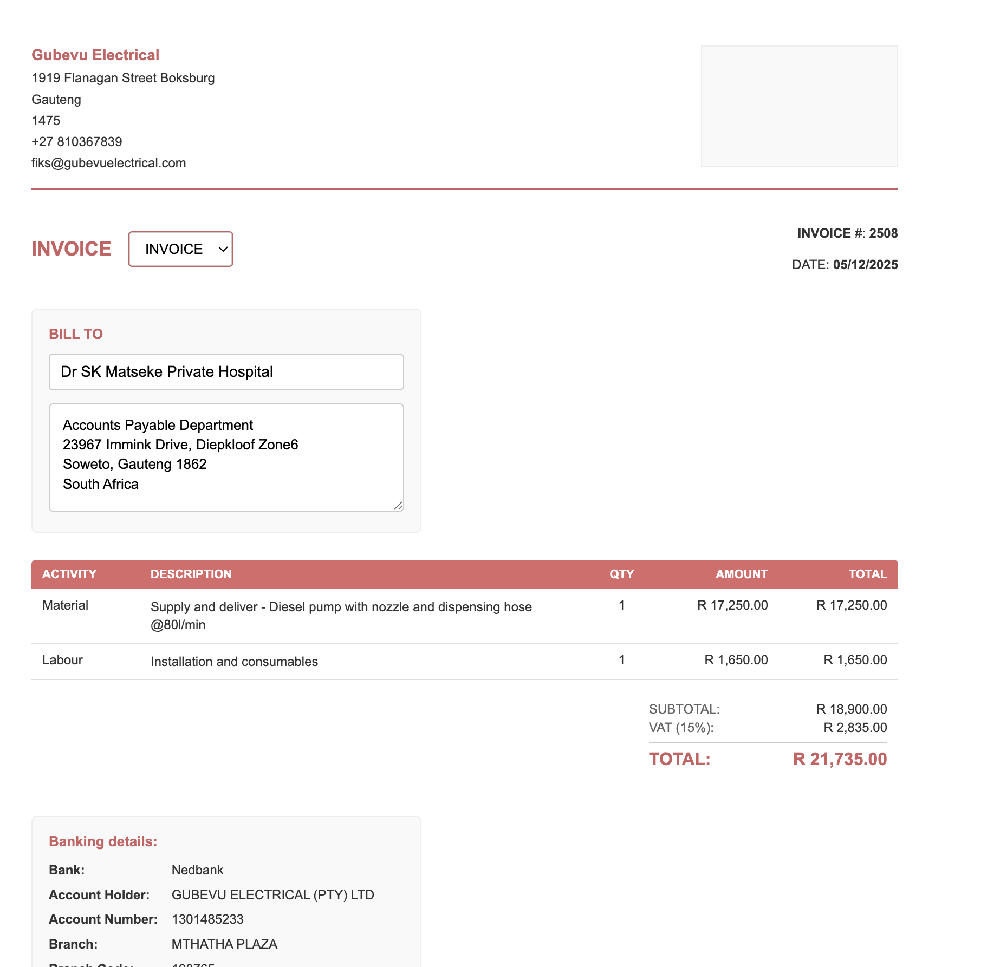

# Gubevu Electrical - Quote & Invoice System

A professional, responsive quote and invoice generator for Gubevu Electrical.

## Features
- 📄 Generate quotes and invoices
- 💰 Automatic VAT calculations (15%)
- 🗑️ Delete line items with hover buttons
- 💾 Auto-saves client information
- 🖨️ Print/Export to PDF
- 📱 Responsive design & PWA support
- 📱 Installable on phone home screens

## Live Demo
[View on GitHub Pages](https://yourusername.github.io/gubevu-invoice/)

## Installation
1. Visit the live demo URL
2. On mobile: Tap "Add to Home Screen" to install as an app
3. On desktop: Use directly in browser

## File Structure
gubevu-invoice/
├── index.html # Main application
├── manifest.json # PWA configuration
├── sw.js # Service worker for offline use
├── README.md # This documentation
├── screenshot.png # Application screenshot
└── assets/ # All assets
├── logo.png # Company logo
└── icons/ # Application icons
├── icon-192.png
├── icon-512.png
└── ...

text

## Development
To run locally:
1. Download all files
2. Open `index.html` in any modern browser
3. No server or installation required

## Customization
1. Replace `assets/logo.png` with your company logo
2. Update company details in `index.html`
3. Modify colors in the CSS variables at the top of `index.html`

## Browser Support
- ✅ Chrome (recommended)
- ✅ Safari
- ✅ Firefox
- ✅ Edge

## License
MIT License - Free to use and modify
